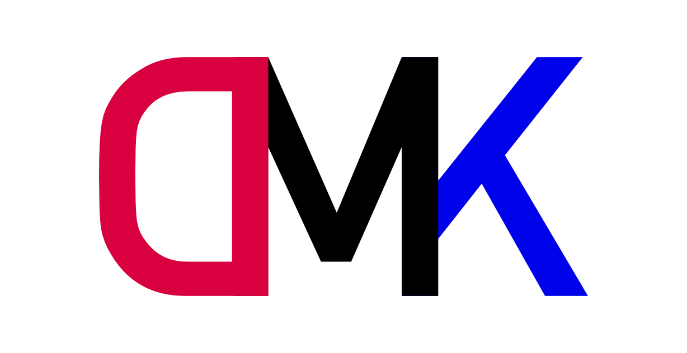

**Language / Язык:** [English](README.md) | [Русский](README_ru.md)

---

# DMK Firmware



A lightweight, modern, and highly modular keyboard firmware designed for cross-platform MCU compatibility.

**Documentation:** [Build](docs/en/build.md) • [Config](docs/en/config.md) • [Keycodes](docs/en/keycodes.md) • [Keymap](docs/en/keymap.md) • [Pins](docs/en/pins.md) • [Vial](docs/en/vial.md)

## Features

### Hardware & Platform Support

- **Cross-MCU Architecture**: Single unified core codebase supporting multiple microcontrollers:
  - **Milandr** (K1986BE92FI)
  - **Raspberry Pi RP2040 / RP2350**
  - **Nordic Semiconductor nRF52840**
  - **Baikal** (BE-U1000)
- **Split Keyboard Support**: Hardware and software (bit-bang/UART) split communication between halves.
- **6KRO (6-Key Roll Over)**: Reliable USB HID reporting allowing up to 6 concurrent keypresses plus modifiers.
- **FreeRTOS Integration**: Built on top of FreeRTOS for robust multi-tasking, reliable scanning, and clean event-driven queues.

### Advanced Layout & Keymap Features

| Feature                   | Code / Macro              | Description                                                                                          |
| :------------------------ | :------------------------ | :--------------------------------------------------------------------------------------------------- |
| **Nested Layers**         | `K_TRNS`, `0..15`         | Up to 16 active stacked layers with transparent fallback resolution                                  |
| **Momentary Switch**      | `MO(layer)`, `L_0..L_15`  | Activates a layer while held down                                                                    |
| **Layer Toggle**          | `TG(layer)`               | Toggles a layer state on or off                                                                      |
| **One-Shot (Sticky)**     | `OS(K_LSFT)`, `OS(layer)` | Activates a modifier or layer for the next single keypress                                           |
| **Hold-Tap**              | `HT(hold, tap)`           | Sends one keycode on quick tap and another (or layer/mod) on hold                                    |
| **Modified Key**          | `MK(mod, key)`            | Sends a keycode combined with a modifier mask (e.g., `Shift + D`)                                    |
| **Physical Chords**       | `my_chords[]`             | Triggers custom macros/actions when multiple keys are pressed together                               |
| **Multi-Step Macros**     | `M(index)`                | Executes sequences of key-down, key-up, and precise millisecond delays                               |
| **Layer & Language Sync** | `M(index)` + `TG(layer)`  | Macros can trigger OS language hotkeys (`Shift+Alt`) and toggle layers for separate language keymaps |
| **Vial / VIA GUI**        | `#define VIAL`            | Real-time layout editing, dynamic macros, and key remaps via Vial GUI                                |

---

## Codebase Size Comparison

DMK is not the most feature-rich firmware, and that is an intentional decision. The project does not aim to fully replicate all the functionality of QMK/ZMK/TMK/RMK/KMK, where the codebase size has grown significantly due to an excess of rarely used features.

DMK focuses on a limited set of features that is sufficient for 99% of users. At the same time, thanks to the simplicity and transparency of the code, any missing functionality can easily be added independently.

Thanks to this approach, support for new microcontrollers can be added very quickly and easily (the main requirement is FreeRTOS support). For example, support for Milandr and Baikal MCUs was added.

Below is a comparison of the codebase size of DMK and other firmwares. Measured in source lines of code (SLOC) — only `.c`, `.h`, `.cpp`, `.rs` files are included; documentation, configs, third-party libraries, and auto-generated files are excluded.

| Project                                                | Language | SLOC   | Relative to DMK |
| :----------------------------------------------------- | :------- | :----- | :-------------- |
| **DMK** (~5.7K core + ~2.9K platforms)                 | C        | ~8.6K  | 1×              |
| [ZMK](https://github.com/zmkfirmware/zmk) (app)        | C        | ~24.5K | 2.8×            |
| [TMK](https://github.com/tmk/tmk_keyboard) (tmk\_core) | C        | ~33K   | 3.8×            |
| [RMK](https://github.com/HaoboGu/rmk)                  | Rust     | ~54K   | 6.3×            |
| [QMK / Vial-QMK](https://github.com/vial-kb/vial-qmk)  | C        | ~76K   | 8.8×            |

---

## Roadmap & Planned Features

Below is our current development roadmap:

- [ ] **Physical Rotary Encoders**
- [ ] **OLED Display Support**
- [ ] **E-Ink Display Support**
- [ ] **Memory LCD Display Support**
- [ ] **Implement mousekeys**

### Bluetooth (BLE) Policy

Full BLE support is explicitly out of scope:

- **Minimal Codebase**: Adding BLE stacks and power management multiplies codebase size. DMK prioritizes simplicity.
- **Wired Focus**: USB operation doesn't require complex low-power sleep state machines.
- **Focus on Unique MCUs**: DMK targets platforms lacking keyboard firmwares (Milandr, Baikal). For nRF52 BLE, solutions like ZMK or RMK already exist.

If wireless capability is needed, it can be offloaded to an external Bluetooth module over UART without complicating the core.

---

## Build System

Build target firmware cleanly using the provided `./build_all.sh` helper script.

### Usage

```bash
./build_all.sh [OPTIONS]
```

### Build Commands Examples

- **Clean build Corne (RP2040)**:

  ```bash
  ./build_all.sh -b corne --mcu rp2040 -c
  ```

- **Clean build Kabarga (nRF52840)**:

  ```bash
  ./build_all.sh -b kabarga --mcu nrf52840 -c
  ```

- **Clean build Pncateho (nRF52840)**:

  ```bash
  ./build_all.sh -b pncateho --mcu nrf52840 -c
  ```
